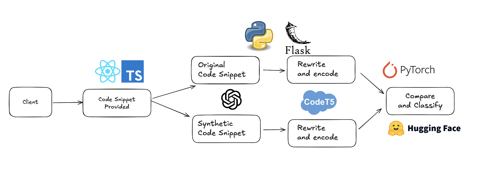

# CodeWatch

## Project Description

CodeWatch is an AI code detection tool that applies recently published research techniques in order to classify code as either human written or AI generated.

## How It Works

### Intuition

Generative LLMs "write" code by continously predicting the next most likely token. We can leverage this in order to detect code whether code is likely AI generated or human generated. If we ask an LLM to write code to answer a certain prompt, it would likely have similar answers because it would be constantly picking on of the few most likely tokens.

Humans, however, don't think the same way and typically have somewhat unique style of writing code. If we ask an LLM to rewrite this code, it typically ditches the structure of human code and changes quite a lot of structure (because it uses its token prediction method for generation). However, for AI generated code, since it already is generated by the token prediction mechanism, it changes very little.

We can leverage this to detect AI generated code.

### Visualization



### Steps

1. We take in source code that can be either human-written or AI-generated. Our task is to classify the code appropriately
2. We ask an LLM to understand the functionality of the code and then rewrite it by itself
3. We now have two code snippets, one that could be generated by AI/Humans and one that is defintiely generated by an AI.
4. We rewrite our code k times. We used k=2 in order to avoid rate limits but k >= 4 is idea according to the paper.
5. We create embeddings of all of the code snippets that we now have. Then we apply cosine similarity to conduct comparisons of the embeddings. We compare the difference between the original code (reminder, this can be AI generated or human written) rewrites and the AI code rewrites. If there is substantial deviation, it is likely human written. If the deviation is small, then it is most likely AI geneated

## Team Members

- Zhen Tao Pan
- Ashraful Mahin
- Ataur Muhith
- Nakib Abedin

## Features

- AI code detection using novel research techniques
- Fine-tuning of natural language embedding models to better work with code
- Code comparisons in embedded vector spaces using cosine similarity

## Tech Stack

- Frontend: React.js, TypeScript
- Backend: Python, Flask
- AI/ML: PyTorch, Transformers, CodeT5+

## Getting Started

### Prerequisites

- Node.js >= 18.0.0
- Python >= 3.8
- pip (Python package manager)

### Installation

#### Frontend Setup

1. Clone the repository

```bash
git clone https://github.com/MahinAshraful/CodeWatch.git
cd CodeWatch/frontend
```

2. Install frontend dependencies

```bash
npm install
```

#### Backend Setup

1. Navigate to backend directory

```bash
cd ../backend
```

2. Create and activate virtual environment

```bash
python -m venv venv
source venv/bin/activate  # On Windows use: venv\Scripts\activate
```

3. Install backend dependencies

```bash
pip install -r requirements.txt
```

4. Set up environment variables

```bash
# Create .env file in backend directory
touch .env

# Add your API keys
OPENAI_API_KEY=your_openai_api_key
```

### Running the Application

1. Start the backend server

```bash
cd backend
python app.py
```

2. Start the frontend development server (in a new terminal)

```bash
cd frontend
npm run dev
```

## Usage

1. Open `http://localhost:5173` in your browser
2. Use the code editor to paste or write your code
3. Click "Detect AI Code" to start analysis
4. View results showing:
   - AI likelihood score
   - Code similarity metrics
   - Pattern analysis
   - Detailed comparisons

## Project Structure

```
CodeWatch/
├── frontend/
│   ├── components/          # React components
│   │   ├── CodeEditor.tsx
│   │   ├── ResultsDisplay.tsx
│   │   └── ...
│   ├── src/                # Core frontend files
│   └── public/             # Static assets
├── backend/
│   ├── app.py             # Flask server
│   ├── detect.py          # Detection logic
│   └── requirements.txt   # Python dependencies
```

## API Endpoints

| Endpoint  | Method | Description                           |
| --------- | ------ | ------------------------------------- |
| `/detect` | POST   | Submit code for AI detection analysis |

### Request Format

```json
{
	"code": "// Your code string here"
}
```

### Response Format

```json
{
	"original_similarity": 0.8534,
	"ai_similarity": 0.9123,
	"difference": 0.0589,
	"result": "LIKELY AI-GENERATED"
}
```

## Contributing

1. Fork the repository
2. Create your feature branch

```bash
git checkout -b feature/YourFeature
```

3. Commit your changes

```bash
git commit -m 'Add some feature'
```

4. Push to the branch

```bash
git push origin feature/YourFeature
```

5. Open a Pull Request

## License

MIT License

## Acknowledgments

- OpenAI GPT-4 for code analysis
- CodeT5+ for code embeddings
- React and TypeScript for frontend framework
- Flask for backend API
- Tailwind CSS for styling
